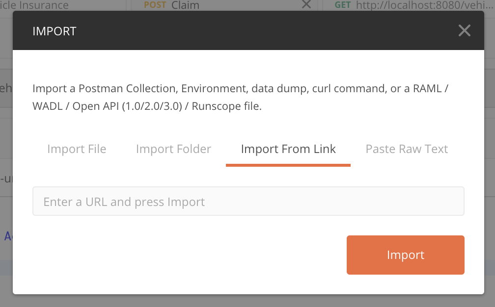
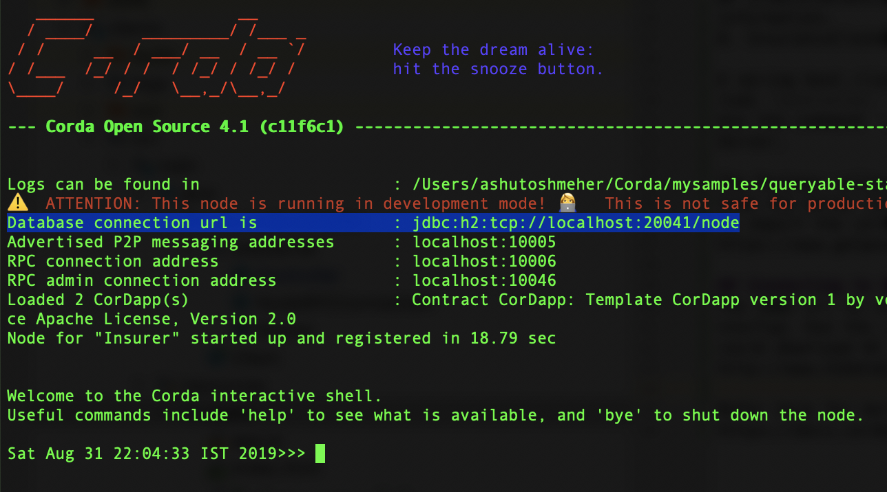

# Postgres  

This CorDapp is an extension of the Corda Kotlin Car Insurance sample app, available [here](https://github.com/corda/samples-kotlin/tree/master/Features/queryableState-carinsurance).

Additionally, it demonstrates how to create a driver test using docker to run tests using a Postgres database. This can be useful to check that your database migrations will work on Postgres as sometimes there are discrepancies between how migrations run on H2 and Postgres.

It also demonstrates how to use deploynodes to create a local network with postgres as a backing database.

## Car Insurance -- QueryableState

This CorDapp demonstrates how [QueryableState](https://docs.corda.net/docs/corda-os/api-persistence.html) works in Corda. Corda allows developers
to have the ability to expose some or all parts of their states to a custom database
table using an ORM tools. To support this feature the state must implement
`QueryableState`.

In this CorDapp we would use an `Insurance` state and persist its properties in a
custom table in the database.  The `Insurance` state among other fields also
contains an `VehicleDetail` object, which is the asset being insured. We have used
this `VehicleDetail` to demonstrate _One-to-One_ relationship. Similarly we also
have a list of `Claim` objects in the `Insurance` state which represents claims
made against the insurance. We use them to demonstrate _One-to-Many_ relationship.


## Concepts

A spring boot client is provided with the cordapp, which exposes two REST endpoints
(see `Controller` in the clients module) to trigger the flows.
Use the command `./gradlew bootRun` in the project root folder to run the [Spring Boot
Server](https://spring.io/projects/spring-boot#overview).

### Flows

There are two flow in this cordapp:

1. IssueInsurance: It creates the insurance state with the associated vehicle information.

2. InsuranceClaim: It creates the claims against the insurance.


## Usage

## Pre-Requisites

For development environment setup, please refer to: [Setup Guide](https://docs.corda.net/getting-set-up.html).


### Running the CorDapp

Open a terminal and go to the project root directory and type: (to deploy the nodes using bootstrapper)
```
./gradlew clean deployNodes
```
Then type: (to run the nodes)
```
./build/nodes/runnodes
```


### Interacting with the nodes

The Postman collection containing API's calls to the REST endpoints can be imported
from the link: https://www.getpostman.com/collections/ddc01c13b8ab4b5e853b.
Use the option Import > Import from Link option in Postman to import the collection.

<p align="center">

</p>


### Connecting to the Database

The JDBC url to connect to the database would be printed in the console in node
startup. Use the url to connect to the database using a suitable client. The
default username is 'sa' and password is '' (blank).
You could download H2 Console to connect to h2 database here:
http://www.h2database.com/html/download.html

<p align="center">
  
</p>

Refer here for more details regarding connecting to the node database.
https://docs.corda.net/head/node-database-access-h2.html